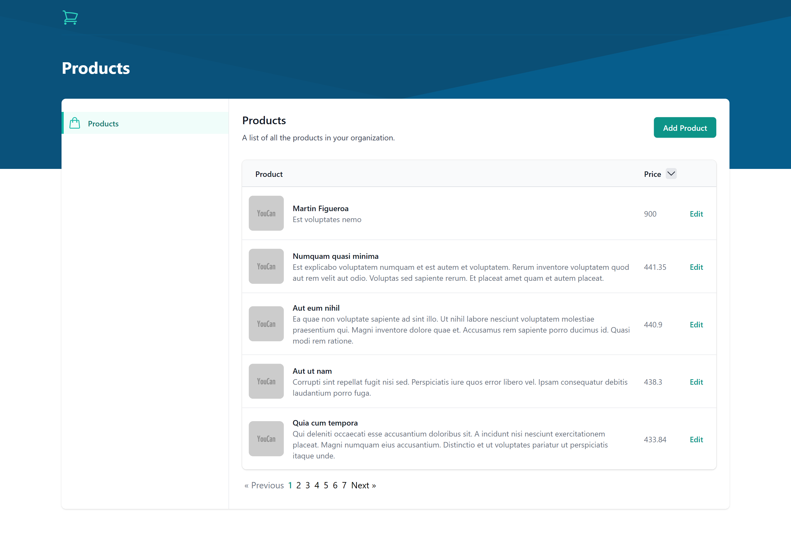
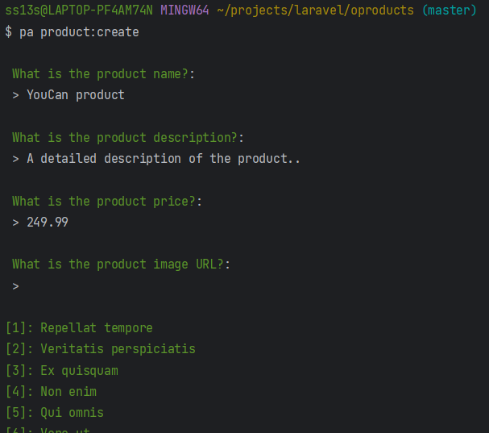

# OProducts



## Installation

### Requirements

- PHP 8
- Composer
- Node.js
- NPM

### Installation Steps

1. Clone the repository

   ```bash
   git clone https://github.com/omaghd/products.git
   ```

2. Install the dependencies

   ```bash
   cd products && composer install
   ```

   ```bash
   npm install
   ```

3. Create a copy of your .env file

   ```bash
   cp .env.example .env
   ```

4. In the .env file, add database information to allow Laravel to connect to the database

   ```env
   DB_CONNECTION=mysql
   DB_HOST=
   DB_PORT=
   DB_DATABASE=
   DB_USERNAME=
   DB_PASSWORD=
   ```

5. Generate an app encryption key

   ```bash
   php artisan key:generate
   ```

6. Migrate and seed the database

   ```bash
   php artisan migrate --seed
   ```

7. Launch the backend

   ```bash
   php artisan serve
   ```

8. Launch the vue app

   ```bash
   npm run dev
   ```

9. Visit the application

   ```bash
   http://localhost:8000
   ```

10. Link the storage folder in the backend

    ```bash
    php artisan storage:link
    ```

## Usage

### Tests

To run the tests in the backend, run the following command:

   ```bash
   php artisan test
   ```

### CLI

To run the CLI command to create a new product, run the following command:

   ```bash
   php artisan product:create
   ```

After running the command, you will be asked to enter the product name, description, price, image URL (optional), and category IDs separated by commas (e.g. 1,2,5).


